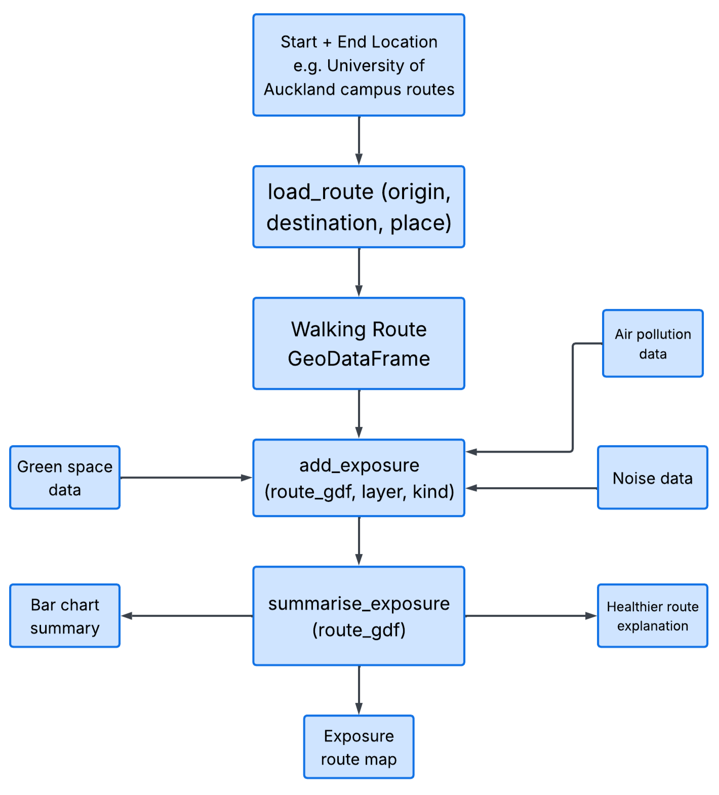
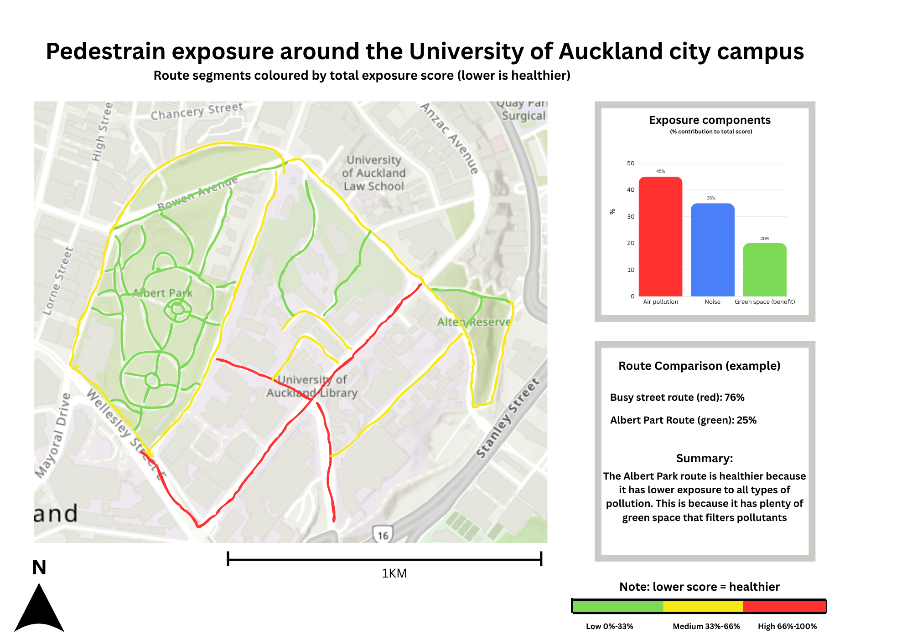

## Problem statement

This package explores how pollution and environmental conditions affect walking routes around the University of Auckland city campus. The project aims to identify which routes may provide a healthier walking experience for pedestrians and why.

This project responds to growing concerns about transportation-related pollution exposure in dense urban environments such as Auckland’s CBD. According to Jovanovic et al. (2024), minimising travel time does not always produce more environmentally friendly routes because streets differ in traffic levels, pollution exposure, and surrounding environmental conditions. Common navigation tools such as Google Maps or the AT app mainly focus on efficiency and travel time, while environmental conditions along pedestrian routes are often overlooked. In addition, current air quality monitoring is commonly collected from fixed stations rather than through more flexible and mobile approaches, which can limit how accurately pollution exposure is represented across smaller urban areas (El Arfaoui et al., 2026).

The package also responds to wider urban issues relating to how environmental conditions change across short walking journeys. Research on eco-routing has shown that different routes may be considered “optimal” depending on whether travel time, emissions, or pollution exposure is prioritised (Kwong et al., 2025). However, much of this research focuses on vehicle emissions and traffic simulation rather than pedestrian-scale exposure within urban environments.

By combining walking routes with air pollution, noise, and green space data, the pedestrian-exposure package aims to provide clearer and more accessible information about environmental exposure around the UoA city campus. The package is designed for students, researchers, planners, and members of the public who want to better understand which walking routes may provide a healthier and more comfortable walking experience.

## Pipeline diagram

The package combines environmental and walking route data to produce a scored walking route around the UoA campus. @fig-pipeline shows the main functions, data inputs, and final outputs.

{#fig-pipeline height=50% fig-pos="H"}

## Expected output

@fig-output shows a rough estimate of the final output. The package will produce a walking route map for the University of Auckland city campus and surrounding streets that students use to get to class. Each walking route will be coloured according to its total pedestrian exposure score; higher scores represent routes with higher exposure to pollution and noise.

The output combines three environmental exposure components: air pollution, noise, and green space. Allowing users to compare different walking routes around the campus and identify greener paths. For example, Albert Park or streets like Alfred Street may be greener and less polluted than routes near roads.
The final notebook output will include a small bar chart summarising the contributions of all pollutant types to the overall route score. It will also include a short summary statement explaining which route may be healthier and why. 

{#fig-output width=80% fig-pos="H"}

## Key design choices

- **Study area**: we focus on walking routes around the University of Auckland city campus because this is an area we can observe ourselves, and it has a mix of busy roads, quiet campus paths, and green spaces such as Albert Park
- **CRS**: we use EPSG:2193 (NZTM) because it works well for New Zealand data and lets us measure route length and nearby green space in metres
- **Data pattern**: the walking route will be fetched using OSMnx, while small example data can be saved inside the package for testing. This keeps the package easier to run and avoids relying on large files
- **Exposure factors**: we use noise, air pollution, and green space because these three factors help explain whether a walking route feels healthy, busy, or comfortable
- **Time of measurement**: we focus mainly on peak traffic hours because this is when pedestrians are likely to experience the highest levels of traffic noise and air pollution around campus. This also makes the route comparison more realistic for students walking to class during busy periods
- **Scoring direction**: a lower total exposure score means a healthier walking route. This makes the final map easier to understand because green can show lower exposure, yellow can show medium exposure, and red can show higher exposure
- **Function structure**: we keep the three main steps separate: `load_route()` gets the walking route, `add_exposure()` adds the exposure information, and `summarise_exposure()` creates the final score and summary
- **Trade-off**: the score will be a simple estimate, not a perfect health measure. However, this makes the package easier to test, explain, and use within the assignment timeframe

## Roles and next function

- Monica: Implementing `load_route()` using OSMnx, Route mapping and visualisation, Organising GeoDataFrames and CRS handling, Creating the final exposure route map
- Lewis: Implementing `add_exposure()`, Attaching air pollution, noise, and green space data, Cleaning and preparing environmental datasets, Supporting testing and debugging
- Jess: Assisting with route exposure scoring logic, Reviewing documentation and package structure, Writing the demo notebook, Creating charts and visual outputs
- Shared responsibilities: Walking around the University of Auckland city campus to observe routes during peak traffic hours, Implementing `summarise_exposure()`, Testing package outputs and functions, Managing the GitHub repository, Reviewing each other’s code, Preparing the final presentation and poster

Next function to implement after today's lab is `load_route()`, because the package first needs a working walking route around the University of Auckland city campus before exposure data can be added and compared. 

## References

El Arfaoui, A., El Khaili, M., Chakir, I., Arif, O., Nhaila, H., Essamlali, I., & Tabaa, M. (2026). Towards Improving Air Quality Monitoring Using Fixed and Mobile Stations: Case of Mohammedia City. Sustainability, 18(6), 2944. https://doi.org/10.3390/su18062944

Jovanovic, A., Gavric, S., & Stevanovic, A. (2024). Evaluating Google Maps’ Eco-Routes: A Metaheuristic-Driven Microsimulation Approach. Geographies, 4(4), 732-752. https://doi.org/10.3390/geographies4040040

Lam, C. K. C., Alnaqshabandy, H., Lewin, S., Morewood, J., Xie, X., & Goodhew, S. (2025). Making intra-urban monitoring ‘a walk in the park’: A mobile monitoring approach for assessing pedestrians’ environmental conditions. Building and Environment, 113487. https://doi.org/10.1016/j.buildenv.2025.113487 

